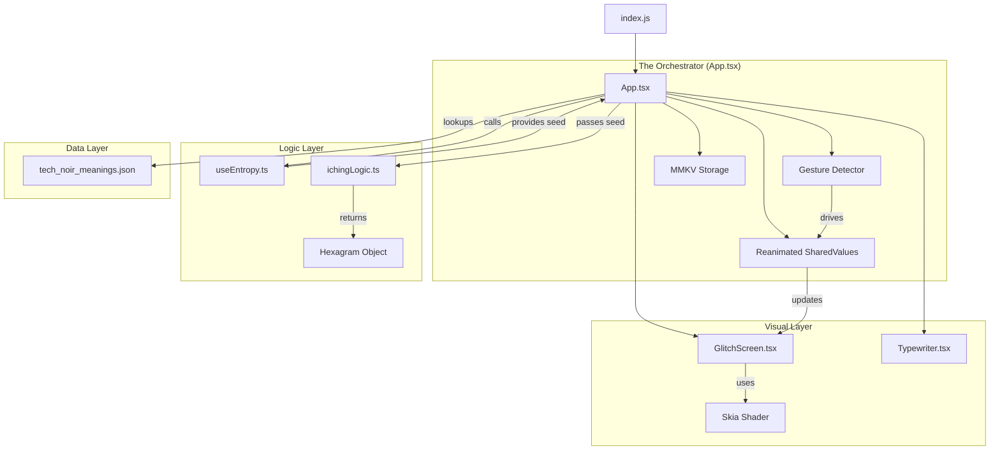

# Architecture and Logic Guide: GLITCHING

**Welcome to the team.** This document is your map to the `glitching` codebase. We've built a "Tech-Noir" divination tool that uses device entropy to generate I Ching readings. It's not just a random number generator; it's a digital ritual.

## 1. The Big Picture (High-Level Flow)

The app is a single-screen experience driven by a "Press & Hold" gesture.

1.  **Idle State**: The user sees a "PRESS & HOLD TO GLITCH" prompt.
2.  **The Ritual (Input)**:
    *   User holds their finger on the screen.
    *   **Visuals**: A custom GLSL shader (`GlitchScreen`) distorts the view. The longer the hold, the more intense the glitch.
    *   **Feedback**: Haptics tick like a Geiger counter (building tension).
3.  **The Snap (Trigger)**:
    *   After 3 seconds, the app "snaps."
    *   **Entropy**: We harvest data (battery level + exact timestamp) to create a unique "seed."
    *   **Logic**: This seed drives a deterministic RNG to generate a Hexagram (6 lines).
    *   **Persistence**: We save this reading to local storage (MMKV) with today's date.
4.  **The Reveal (Output)**:
    *   The "Glitch Speak" interpretation types out on the screen (`Typewriter` component).
    *   **Daily Lock**: If the user closes and reopens the app today, they see this same reading immediately. "The System has already spoken."

---

## 2. Entry Points

*   **`index.js`**: The absolute start. It registers `App` as the root component.
*   **`App.tsx`**: The Brain. This file orchestrates everything. It holds the state, manages the animation loop, handles the gesture, and coordinates the "Ritual" flow described above.

---

## 3. Key Logic Modules

### A. The "Glitch" Visuals (`src/components/GlitchScreen.tsx`)
*   **What it is**: A **React Native Skia** canvas.
*   **How it works**: It runs a custom **GLSL Shader** program on the GPU.
*   **Key Concept**: It accepts a `distortion` value (0.0 to 1.0).
    *   0.0 = Black screen.
    *   1.0 = Full visual chaos (pixels displacing horizontally).
    *   This value is driven by the `useSharedValue` in `App.tsx`.

### B. Entropy & Mathematics (`src/hooks/useEntropy.ts` & `src/utils/ichingLogic.ts`)
*   **`useEntropy.ts`**:
    *   Collects "Chaos" from the physical world (Battery % + Millisecond Timestamp).
    *   Returns a numeric `seed`.
*   **`ichingLogic.ts`**:
    *   **Pure Logic**. It takes that `seed` and uses a **Linear Congruential Generator (LCG)** (a simple pseudo-random algorithm) to simulate 6 coin tosses.
    *   It outputs a `HexagramReading` object (e.g., Primary Hexagram #4, Changing Lines [1, 5]).

### C. Persistence (`App.tsx` + MMKV)
*   **The Rule**: One reading per day.
*   **Mechanism**:
    *   On App Launch (`useEffect`): Check MMKV for key `reading_YYYY-MM-DD`.
    *   If found -> Load it, lock the UI, show results.
    *   If not found -> Allow the "Press & Hold" ritual.

---

## 4. Design Patterns

We prefer simplicity and functional patterns over heavy object-oriented structures.

1.  **Orchestrator Pattern (`App.tsx`)**:
    *   The `App` component is the "Puppet Master." It doesn't do the heavy lifting itself; it delegates.
    *   It tells `GlitchScreen` *when* to distort.
    *   It tells `useEntropy` *when* to harvest.
    *   It tells `MMKV` *when* to save.
2.  **Hook-Based Separation**:
    *   Logic is extracted into hooks (e.g., `useEntropy`). This keeps the UI components clean and focused on rendering.
3.  **Singleton (Implicit)**:
    *   `storage = new MMKV()` is declared once at the module level in `App.tsx`. It acts as a globally available singleton for storage.
4.  **Data-Driven UI**:
    *   The meaning of the hexagrams isn't hardcoded in switch statements. It's loaded from an external JSON file (`tech_noir_meanings.json`). The app just looks up `meanings[hexagramNumber]`.

---

## 5. Module Relationships (Mermaid Diagram)

---

## 6. Onboarding Tips for You

*   **Don't fear the Shader**: The GLSL code in `GlitchScreen.tsx` looks scary (`vec4`, `fract(sin(...))`). You rarely need to touch it. It just takes a number input and makes pixels messy.
*   **Respect the Daily Lock**: When testing, you might get annoyed that you can't generate a new reading.
    *   *Hack*: Change the `getTodayKey` function in `App.tsx` to include hours/minutes if you need to debug the generation flow repeatedly.
*   **Haptics are Key**: The "feel" of the app is just as important as the look. The `useAnimatedReaction` in `App.tsx` is what binds the visual glitch to the physical vibration.
